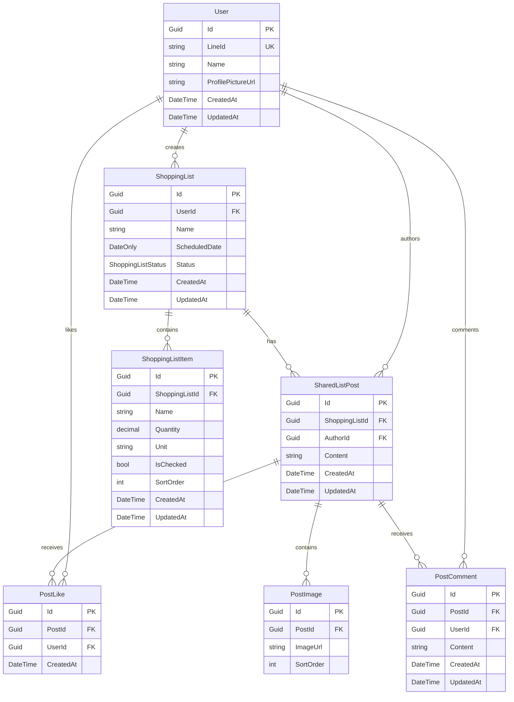

# 購物清單模組 API 實作規劃

**建立日期**: 2025-12-26  
**對應前端規格**: [shopping_lists_api_spec.md](../frontend/shopping_lists_api_spec.md)

---

## 1. 概述

本文件規劃購物清單模組的後端實作，包含：
- 資料庫 Schema 設計
- Entity 模型
- API 端點實作
- Migration 計畫

---

## 2. 資料庫設計

### 2.1 ER Diagram



### 2.2 資料表設計

#### 2.2.1 `shopping_lists` 購物清單

| 欄位 | 型別 | 約束 | 說明 |
|------|------|------|------|
| `id` | `uuid` | PK | 使用 UUID v7 |
| `user_id` | `uuid` | FK → users.id, NOT NULL | 建立者 |
| `name` | `varchar(100)` | NOT NULL | 清單名稱 |
| `scheduled_date` | `date` | NULLABLE | 預計購買日期 |
| `status` | `shopping_list_status` | NOT NULL, DEFAULT 'in-progress' | 清單狀態 |
| `created_at` | `timestamptz` | NOT NULL | 建立時間 |
| `updated_at` | `timestamptz` | NOT NULL | 更新時間 |

**索引**:
- `idx_shopping_lists_user_id` ON `user_id`
- `idx_shopping_lists_scheduled_date` ON `scheduled_date`
- `idx_shopping_lists_status` ON `status`

#### 2.2.2 `shopping_list_items` 清單項目

| 欄位 | 型別 | 約束 | 說明 |
|------|------|------|------|
| `id` | `uuid` | PK | 使用 UUID v7 |
| `shopping_list_id` | `uuid` | FK → shopping_lists.id, NOT NULL, ON DELETE CASCADE | 所屬清單 |
| `name` | `varchar(255)` | NOT NULL | 項目名稱 |
| `quantity` | `decimal(10,2)` | NOT NULL, DEFAULT 1 | 數量 |
| `unit` | `varchar(30)` | NULLABLE | 單位 |
| `is_checked` | `boolean` | NOT NULL, DEFAULT false | 是否已勾選 |
| `sort_order` | `integer` | NOT NULL, DEFAULT 0 | 排序順序 |
| `created_at` | `timestamptz` | NOT NULL | 建立時間 |
| `updated_at` | `timestamptz` | NOT NULL | 更新時間 |

**索引**:
- `idx_shopping_list_items_list_id` ON `shopping_list_id`

#### 2.2.3 `shared_list_posts` 分享貼文

| 欄位 | 型別 | 約束 | 說明 |
|------|------|------|------|
| `id` | `uuid` | PK | 使用 UUID v7 |
| `shopping_list_id` | `uuid` | FK → shopping_lists.id, NOT NULL | 關聯的購物清單 |
| `author_id` | `uuid` | FK → users.id, NOT NULL | 作者 |
| `content` | `text` | NOT NULL | 貼文內容 |
| `created_at` | `timestamptz` | NOT NULL | 建立時間 |
| `updated_at` | `timestamptz` | NOT NULL | 更新時間 |

**索引**:
- `idx_shared_list_posts_list_id` ON `shopping_list_id`
- `idx_shared_list_posts_author_id` ON `author_id`
- `idx_shared_list_posts_created_at` ON `created_at DESC`

#### 2.2.4 `post_images` 貼文圖片

| 欄位 | 型別 | 約束 | 說明 |
|------|------|------|------|
| `id` | `uuid` | PK | 使用 UUID v7 |
| `post_id` | `uuid` | FK → shared_list_posts.id, NOT NULL, ON DELETE CASCADE | 所屬貼文 |
| `image_url` | `varchar(500)` | NOT NULL | 圖片 URL |
| `sort_order` | `integer` | NOT NULL, DEFAULT 0 | 排序順序 |

**索引**:
- `idx_post_images_post_id` ON `post_id`

#### 2.2.5 `post_likes` 貼文按讚

| 欄位 | 型別 | 約束 | 說明 |
|------|------|------|------|
| `id` | `uuid` | PK | 使用 UUID v7 |
| `post_id` | `uuid` | FK → shared_list_posts.id, NOT NULL, ON DELETE CASCADE | 目標貼文 |
| `user_id` | `uuid` | FK → users.id, NOT NULL | 按讚者 |
| `created_at` | `timestamptz` | NOT NULL | 按讚時間 |

**約束**:
- `uq_post_likes_post_user` UNIQUE ON (`post_id`, `user_id`)

#### 2.2.6 `post_comments` 貼文留言

| 欄位 | 型別 | 約束 | 說明 |
|------|------|------|------|
| `id` | `uuid` | PK | 使用 UUID v7 |
| `post_id` | `uuid` | FK → shared_list_posts.id, NOT NULL, ON DELETE CASCADE | 目標貼文 |
| `user_id` | `uuid` | FK → users.id, NOT NULL | 留言者 |
| `content` | `text` | NOT NULL | 留言內容 |
| `created_at` | `timestamptz` | NOT NULL | 建立時間 |
| `updated_at` | `timestamptz` | NOT NULL | 更新時間 |

**索引**:
- `idx_post_comments_post_id` ON `post_id`

### 2.3 Enum 定義

#### `shopping_list_status`

```sql
CREATE TYPE shopping_list_status AS ENUM (
    'in-progress',      -- 進行中（預設）
    'pending-purchase', -- 待購買
    'completed'         -- 已完成
);
```

---

## 3. Entity 模型設計

### 3.1 檔案結構

```
FuFood/
├── Models/
│   ├── Entities/
│   │   ├── ShoppingList.cs          # [NEW] 購物清單
│   │   ├── ShoppingListItem.cs      # [NEW] 清單項目
│   │   ├── SharedListPost.cs        # [NEW] 分享貼文
│   │   ├── PostImage.cs             # [NEW] 貼文圖片
│   │   ├── PostLike.cs              # [NEW] 貼文按讚
│   │   └── PostComment.cs           # [NEW] 貼文留言
│   ├── Enums/
│   │   └── ShoppingListStatus.cs    # [NEW] 清單狀態列舉
│   └── Requests/
│       ├── ShoppingListCreateRequest.cs    # [NEW]
│       ├── ShoppingListUpdateRequest.cs    # [NEW]
│       ├── SharedListPostCreateRequest.cs  # [NEW]
│       └── PostCommentCreateRequest.cs     # [NEW]
```

### 3.2 Entity 程式碼範例

#### ShoppingList.cs

```csharp
using System.ComponentModel.DataAnnotations;
using System.ComponentModel.DataAnnotations.Schema;
using FuFood.Models.Enums;

namespace FuFood.Models.Entities;

public class ShoppingList
{
    [Key]
    [DatabaseGenerated(DatabaseGeneratedOption.None)]
    public Guid Id { get; set; } = Guid.CreateVersion7();

    [StringLength(100)]
    public required string Name { get; set; }

    public DateOnly? ScheduledDate { get; set; }

    public ShoppingListStatus Status { get; set; } = ShoppingListStatus.InProgress;

    public required Guid UserId { get; set; }
    public virtual User? User { get; set; }

    public virtual ICollection<ShoppingListItem> Items { get; set; } = [];
    public virtual ICollection<SharedListPost> Posts { get; set; } = [];

    public DateTime CreatedAt { get; set; } = DateTime.UtcNow;
    public DateTime UpdatedAt { get; set; } = DateTime.UtcNow;
}
```

#### ShoppingListItem.cs

```csharp
using System.ComponentModel.DataAnnotations;
using System.ComponentModel.DataAnnotations.Schema;
using System.Text.Json.Serialization;

namespace FuFood.Models.Entities;

public class ShoppingListItem
{
    [Key]
    [DatabaseGenerated(DatabaseGeneratedOption.None)]
    public Guid Id { get; set; } = Guid.CreateVersion7();

    [StringLength(255)]
    public required string Name { get; set; }

    public decimal Quantity { get; set; } = 1;

    [StringLength(30)]
    public string? Unit { get; set; }

    public bool IsChecked { get; set; } = false;

    public int SortOrder { get; set; } = 0;

    public Guid ShoppingListId { get; set; }
    [JsonIgnore]
    public virtual ShoppingList? ShoppingList { get; set; }

    public DateTime CreatedAt { get; set; } = DateTime.UtcNow;
    public DateTime UpdatedAt { get; set; } = DateTime.UtcNow;
}
```

#### ShoppingListStatus.cs

```csharp
using NpgsqlTypes;

namespace FuFood.Models.Enums;

public enum ShoppingListStatus
{
    [PgName("in-progress")] InProgress,
    [PgName("pending-purchase")] PendingPurchase,
    [PgName("completed")] Completed
}
```

---

## 4. API 端點實作

### 4.1 Controllers 結構

```
FuFood/
├── Controllers/
│   ├── ShoppingListsController.cs      # [NEW] 購物清單 CRUD
│   ├── SharedListPostsController.cs    # [NEW] 貼文相關
│   └── PostCommentsController.cs       # [NEW] 留言相關
```

### 4.2 API 端點對照表

| 方法 | 端點 | Controller 方法 | 說明 |
|------|------|-----------------|------|
| GET | `/api/v1/shopping-lists` | `ShoppingListsController.Index` | 取得清單列表 |
| POST | `/api/v1/shopping-lists` | `ShoppingListsController.Create` | 建立清單 |
| GET | `/api/v1/shopping-lists/{id}` | `ShoppingListsController.Show` | 取得清單詳情 |
| PATCH | `/api/v1/shopping-lists/{id}` | `ShoppingListsController.Update` | 更新清單 |
| DELETE | `/api/v1/shopping-lists/{id}` | `ShoppingListsController.Delete` | 刪除清單 |
| GET | `/api/v1/shopping-lists/{id}/posts` | `SharedListPostsController.Index` | 取得貼文列表 |
| POST | `/api/v1/shopping-lists/{id}/posts` | `SharedListPostsController.Create` | 建立貼文 |
| POST | `/api/v1/posts/{postId}/like` | `SharedListPostsController.ToggleLike` | 按讚切換 |
| POST | `/api/v1/posts/{postId}/comments` | `PostCommentsController.Create` | 建立留言 |

---

## 5. Repositories 設計

```
FuFood/
├── Repositories/
│   ├── ShoppingListRepository.cs       # [NEW]
│   ├── ShoppingListItemRepository.cs   # [NEW]
│   ├── SharedListPostRepository.cs     # [NEW]
│   └── PostCommentRepository.cs        # [NEW]
```

### 5.1 主要方法

#### ShoppingListRepository

```csharp
public class ShoppingListRepository
{
    Task<List<ShoppingList>> ListByUser(User user, int? year, int? month);
    Task<ShoppingList?> GetById(Guid id);
    Task<ShoppingList?> GetByIdForUser(User user, Guid id);
    Task<ShoppingList> Create(ShoppingList list);
    Task<ShoppingList> Update(ShoppingList list);
    Task<bool> Delete(User user, Guid id);
}
```

#### SharedListPostRepository

```csharp
public class SharedListPostRepository
{
    Task<List<SharedListPost>> ListByShoppingList(Guid listId, User currentUser);
    Task<SharedListPost> Create(SharedListPost post);
    Task<SharedListPost> ToggleLike(Guid postId, User user);
}
```

---

## 6. DbContext 更新

需在 `AppDbContext.cs` 中新增：

```csharp
public DbSet<ShoppingList> ShoppingLists { get; set; }
public DbSet<ShoppingListItem> ShoppingListItems { get; set; }
public DbSet<SharedListPost> SharedListPosts { get; set; }
public DbSet<PostImage> PostImages { get; set; }
public DbSet<PostLike> PostLikes { get; set; }
public DbSet<PostComment> PostComments { get; set; }
```

並在 `OnModelCreating` 中設定：

```csharp
// ShoppingListStatus enum mapping
modelBuilder.HasPostgresEnum<ShoppingListStatus>();

// PostLike unique constraint
modelBuilder.Entity<PostLike>()
    .HasIndex(l => new { l.PostId, l.UserId })
    .IsUnique();
```

Program.cs 中也需新增 enum mapping:

```csharp
options.UseNpgsql(connectionString, o => {
    o.MapEnum<UnitType>("product_unit");
    o.MapEnum<ShoppingListStatus>("shopping_list_status");  // 新增
});
```

---

## 7. 實作順序建議

### Phase 1: 基礎建設
1. [ ] 建立 `ShoppingListStatus` enum
2. [ ] 建立 `ShoppingList` entity
3. [ ] 建立 `ShoppingListItem` entity
4. [ ] 更新 `AppDbContext`
5. [ ] 執行 Migration

### Phase 2: 購物清單 CRUD
6. [ ] 建立 `ShoppingListRepository`
7. [ ] 建立 Request DTOs
8. [ ] 建立 `ShoppingListsController`
9. [ ] 測試基本 CRUD

### Phase 3: 貼文功能
10. [ ] 建立 `SharedListPost` entity
11. [ ] 建立 `PostImage` entity
12. [ ] 建立 `PostLike` entity
13. [ ] 執行 Migration
14. [ ] 建立 `SharedListPostRepository`
15. [ ] 建立 `SharedListPostsController`

### Phase 4: 留言功能
16. [ ] 建立 `PostComment` entity
17. [ ] 執行 Migration
18. [ ] 建立 `PostCommentRepository`
19. [ ] 建立 `PostCommentsController`

---

## 8. Migration 命令

```bash
# 建立 Migration
dotnet ef migrations add CreateShoppingLists --project FuFood

# 執行 Migration
dotnet ef database update --project FuFood
```

---

## 9. 注意事項

1. **權限控制**: 所有操作需驗證當前使用者是否有權限存取該資源
2. **軟刪除考量**: 未來可能需要加入 `DeletedAt` 欄位支援軟刪除
3. **分頁**: 貼文列表可能需要實作分頁機制
4. **圖片上傳**: `PostImage.ImageUrl` 可能需要整合 S3 或其他雲端儲存服務
5. **即時通知**: 按讚/留言可考慮整合 WebSocket 推播
